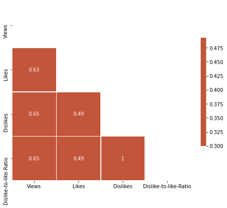
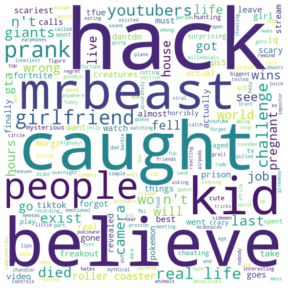
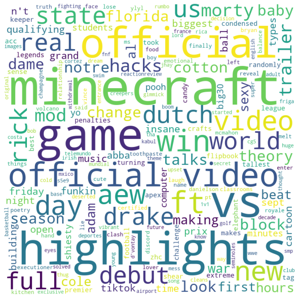
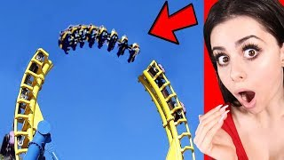

# YouTube Clickbait Data Analysis
 *Reduce time and save attention waisted watching misleading YouTube videos.*

## Framing the Problem

YouTube has over **2 billion active monthly users** and over 122 million active daily users watching over **a billion hours per day**. As the world's second most visited website with over **26 Billion videos**, it's clear how influential it's become. Videos have 3 major components: a **thumbnail**, a **title**, and videos **statistics** such as likes, dislikes, and views.  

Some content creators on the platform have taken to create videos with intentionally misleading titles and thumbnails in order for users of the platform to click on their videos much in the same way some news headlines overexaggerate the content of the article. An overexaggerated video is reffered to as  **clickbait**.

Since clickbait may be interpreted differently by different people, the definition used in this project is: a piece of content that uses an extreme title and thumbnail to mislead the viewer into clicking the video that dosen't deliver on what was promised by the title and thumbnail.

### Objective: Reduce time and save attention waisted watching misleading YouTube videos.

Main Notebooks to check out:
* Data Exploration
* Data Preprocessing & ML estimators
* Title Classifier
* Ensembling the Final Model

## Getting the Data

Using the YouTubeDataV3 API, I wrote a function to retrive the thumbnail, title, and statistics from a given video. For the non-clickbait videos, they were randomely sampled from the Explore page, and checked to confirm that they weren't misleading. 

As for getting the clickbait videos, I ran into a Catch 22 Loop. In order to automatically collect clickbait and non-clickbait videos, I needed an ML system already created which creating one is the end goal of this analysis. 

A clickbait video was determined by its title and thumbnail combination, and was manually selected by 2 different humans to reduce bias. Different genres were sampled as to not give too much weight to any single topic.

Everything can be found in the DataCollection folder, and my dataset is available on Kaggle.

## [Dataset Link](https://www.kaggle.com/thelazyaz/youtube-clickbait-classification):

### Data Collected:

- Video Title
- viewCount
- likeCount
- dislikeCount
- dislike/like ratio
- favoriteCount
- Video Thumbnail

## Exploring the Data

### Key Insights:

 * Clickbait Videos are much more likely to have a lot less balanced video statistics due to their weaker correlations
     
    
 * Clickbait Videos have a much wider distribution of dislikes, which makes sense as the viewer is likely to dislike a video after being mislead by its title and thumbnail.
    * Thus, Clickbait videos also have a significantly smaller distribution of Dislikes/Likes than non-clickbait videos
    
* Clickbait titles will usually contain attention-grabbing verbs such as belive, caught, hack, prank to form titles like the classic: You Won't Belive! or Prank/Hack Gone Wrong

   * While NonClickbait titles will have more mild nouns usually such as highlights, games, and official
   
   
* Key indicators of a clickbait thumbnail are often the use of brightly-colored arrows or circles, a strongly emotional or suprised facial expression of the video creator, contrasting primary colors, and a very unusual/unrealistic preview of the content which is often photoshopped:

    * Non-Clickbait thumbnails are typically identified as having one or none of the features mentioned in the Clickbait thumbnails

## Data Preprocessing & Feature Engineering:

Created a new feature: Dislike to like Ratio as a higher dislike count is often correlated with clickbait video. All of the statistics are scaled to a normal distribution and shuffled randomly. Other video metadata such as ID and Favorites are removed. Non-ascii characters such as emojis are removed from any title as you can't name files with non-ascii characters on windows file systems. 

## Machine Learning Models

- Ensemble of ML Model estimators (Random Forest, K Nearest Neighbors, Support Vector Classifier, XGBoost, Logisitic Regression, Gaussian Naive Bayes) for Video Statistics Classification using soft voting as we want to display probabilities
- Feedforward Neural Network for Video Title Classification using the [Google Universal Sentence Encoder](  https://tfhub.dev/google/universal-sentence-encoder/4), an encoder with with 512 dimensional embeddings trained by a DAN encoder for language classification tasks. It is a 1GB model, so it takes a while to load at first.

- Combining both with my own custom Ensemble model
Used [this](https://www.montana.edu/rotella/documents/502/Prob_odds_log-odds.pdf) to convert logits to logs

## Skills Learned:
- Analyzing distributions and creating correlations for both numerical and natural language data
- Fetching & Parsing through JSON data with the YouTube API
- Ensembling Machine Learning Estimators and Tensorflow Hub NLP models together

## Future Scalability:

- If I had more resources, such as infinite YouTube API Requests or powerful TPUS to train with, then I would use millions and millions of YouTube Videos as training data
  - Though, you would run into the problem of having clickbait classified videos that are what I call: "Meta-Clickbait" where the video itself isn't clickbait, but is instead designed to look like clickbait for comedic purposes of making fun of clickbait
- I could also used Unsupervised Learning to cluster together videos likely/not likely to be clickbait and use them as training examples with Self-Supervised Learning
- I tried to use the thumbnails as possible training features, however, I've found that I get very low accuracy when using them. This is because there are plenty of videos that appear to be clickbait (have contrasting colors, suprised facial expression, punctual shapes) that aren't actually clickbait but may appear to be depending on the viewer.
- Analyzing the sentiment of the top 10 most liked and/or pinned comments would likely increase accuracy. 

A possible software solution could be used by any YouTube user in the form of a web application. Since more than 70% of YouTube watch time comes from mobile devices, the UI of said web app will be suited to mobile devices (though works fine on desktop)
